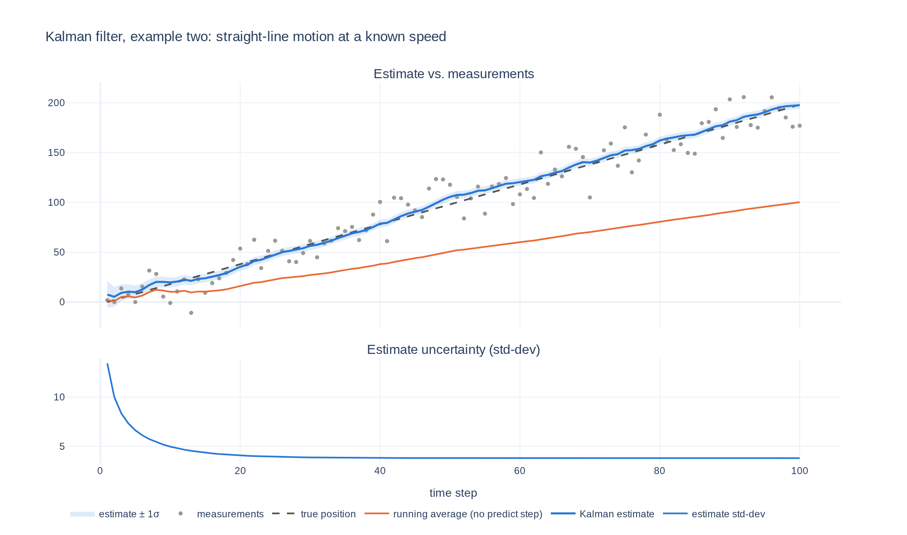

# Understanding the Kalman Filter

[](https://yanglited.github.io/understanding_kalman_filter/example_one.html)
[](LICENSE)


A step-by-step introduction to Kalman filtering. Each example adds one idea, with the math
worked out in full and a runnable NumPy implementation you can plot and experiment with.
Example one estimates a constant value seen through noise. Example two tracks a value moving in
a straight line. The step after that, unknown speed and the matrix form, is outlined at the end
of the math doc.

**[▶ Open the interactive demo](https://yanglited.github.io/understanding_kalman_filter/example_one.html)** (hover, zoom, pan)

## Run it

```bash
uv run example_one.py                 # zero setup: uv fetches numpy + plotly
uv run example_two.py
# or
pip install numpy plotly && python example_one.py
```

Change the problem from the command line:

```bash
uv run example_one.py --measurement-sigma 25 --estimate 0 --estimate-sigma 5 --seed -1
uv run example_one.py --html out.html     # save the interactive plot instead of opening it
```

## Example one: a constant value seen through noise


A hidden constant is observed through Gaussian noise. Each new measurement is folded into the
estimate with the update rule derived in [docs/math.md](docs/math.md):

```python
def update(prior_mean, prior_var, measurement_mean, measurement_var):
    new_mean = (prior_mean * measurement_var + measurement_mean * prior_var) / (prior_var + measurement_var)
    new_var = 1 / (1 / prior_var + 1 / measurement_var)
    return [new_mean, new_var]
```

Two things to notice in the plot:

- The estimate starts at the prior guess (50) and is pulled toward the data within a few steps.
  As measurements accumulate the prior's weight fades and the estimate converges to the plain
  running average, which is what the math predicts for a constant state.
- Unlike the running average, the filter also reports **how sure it is**: the variance shrinks
  with every measurement, and the shaded band narrows to match.

## Example two: a value moving in a straight line

```bash
uv run example_two.py
```

Now the hidden value moves at a known speed. Each step gains a **predict** before the update:
move the estimate by the known motion and add the motion's uncertainty. The math behind it, the
sum of two Gaussians, is worked out in [docs/math.md](docs/math.md#the-sum-of-two-gaussians-the-predict-step),
and the example itself is discussed in [Example Two](docs/math.md#example-two).



- A running average has no predict step, so it falls further behind every step.
- The uncertainty no longer shrinks to zero: predict adds some, update removes some, and they
  balance at a steady state. The floor in the lower panel is derived exactly in the math doc.

## The math

[docs/math.md](docs/math.md) works through everything the examples use:

- Bayes' rule on Gaussians, and why the product of two Gaussians is a Gaussian. This gives the
  **update** step used in example one.
- Why the sum of two Gaussians is a Gaussian. This gives the **predict** step used in example two.
- The steady-state uncertainty of example two, derived and checked against the plot.

## License

MIT
