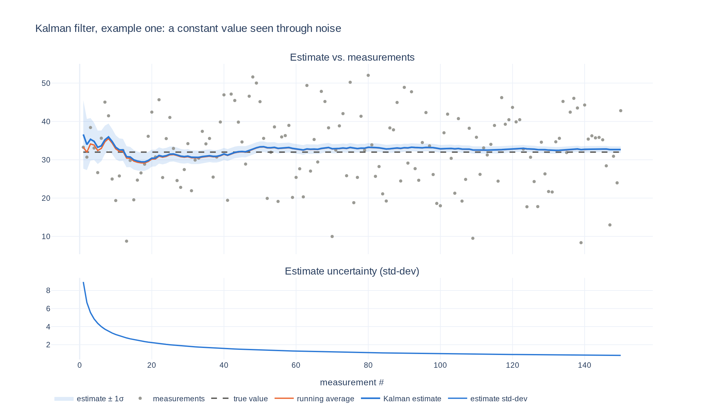

# Understanding the Kalman Filter

[](https://yanglited.github.io/understanding_kalman_filter/example_one.html)
[](LICENSE)


The Kalman filter from first principles: Bayes' rule on two Gaussians, derived by hand, then run
as a 10-line NumPy function. No matrices, no jargon, one example at a time.

**[▶ Open the interactive demo](https://yanglited.github.io/understanding_kalman_filter/example_one.html)** (hover, zoom, pan)



## Run it

```bash
uv run example_one.py                 # zero setup: uv fetches numpy + plotly
# or
pip install numpy plotly && python example_one.py
```

Change the problem from the command line:

```bash
uv run example_one.py --measurement-sigma 25 --estimate 0 --estimate-sigma 5 --seed -1
uv run example_one.py --html out.html     # save the interactive plot instead of opening it
```

## What example one shows

A hidden constant is observed through Gaussian noise. Each new measurement is folded into the
estimate with the Gaussian update rule:

```python
def update(prior_mean, prior_var, measurement_mean, measurement_var):
    new_mean = (prior_mean * measurement_var + measurement_mean * prior_var) / (prior_var + measurement_var)
    new_var = 1 / (1 / prior_var + 1 / measurement_var)
    return [new_mean, new_var]
```

Two things to notice in the plot:

- The estimate starts at the prior guess (50) and is pulled toward the data within a few steps.
  Once the prior is forgotten it tracks the plain running average, which is exactly what the math
  predicts for a constant state.
- Unlike the running average, the filter also reports **how sure it is**: the variance shrinks
  with every measurement, and the shaded band narrows to match.

## The math

[docs/math.md](docs/math.md) derives why the product of two Gaussians is a Gaussian, and
reads off the update rule above from the result.

## License

MIT
