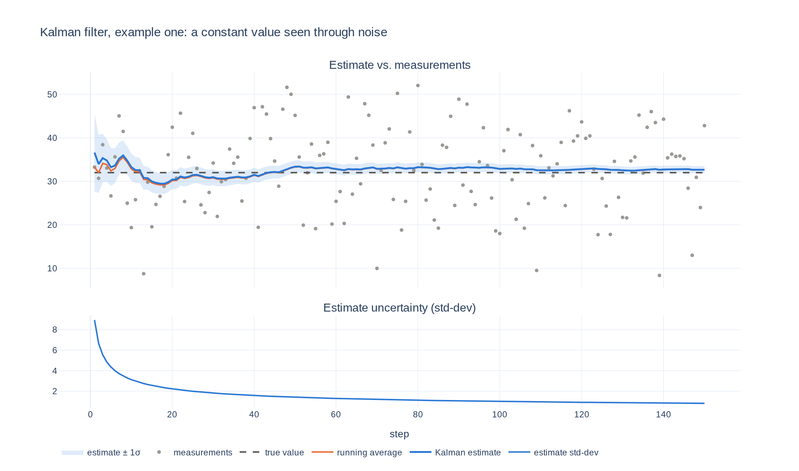

# Example one: a constant value seen through noise

[code](example.py) · [filter](../../kf/filter.py) · [interactive plot](https://yanglited.github.io/understanding_kalman_filter/examples/01_constant_value/plot.html) · [foundation math](../../docs/gaussians.md)

Random variable $X$ takes one value and does not move. We keep making observations on $X$ with
observation noise. Goal is to estimate the true hidden value of $X$.

## The math this example uses

Only the **update** step. With a prior belief $X \sim \mathcal{N}(\mu_p, \sigma_p^2)$ and a
measurement $y$ with noise variance $\sigma_Z^2$, Bayes' rule gives a Gaussian posterior
([derivation](../../docs/gaussians.md#background-information-on-gaussian-pdfs-with-bayes-rule)):

$$
\mu_{new} = \frac{y\sigma_p^2 + \mu_p\sigma_Z^2}{\sigma_p^2 + \sigma_Z^2}, \qquad
\sigma_{new}^2 = \frac{\sigma_Z^2\sigma_p^2}{\sigma_p^2 + \sigma_Z^2}
$$

The posterior becomes the prior for the next measurement. In code this is the `update` function
in [`kf/filter.py`](../../kf/filter.py).

## Run it

```bash
uv run examples/01_constant_value/example.py            # from the repo root
uv run examples/01_constant_value/example.py --measurement-sigma 25 --estimate 0 --estimate-sigma 5 --seed -1
uv run examples/01_constant_value/example.py --html plot.html
```



## What to notice

- The estimate starts at the prior guess (50) and is pulled toward the data within a few steps.
  As measurements accumulate the prior's weight fades and the estimate converges to the plain
  running average, which is what the math predicts for a constant state.
- Unlike the running average, the filter also reports **how sure it is**: the variance shrinks
  with every measurement, and the shaded band narrows to match.

## References

1. [SciPy Cookbook: Kalman filtering](https://scipy-cookbook.readthedocs.io/items/KalmanFiltering.html)
2. [Kalman filters: a step-by-step implementation guide in Python](https://medium.com/analytics-vidhya/kalman-filters-a-step-by-step-implementation-guide-in-python-91e7e123b968)
3. [Garima13a/Kalman-Filters](https://github.com/Garima13a/Kalman-Filters)
4. [Product of two Gaussian PDFs is a Gaussian PDF (Math.SE)](https://math.stackexchange.com/questions/1112866/product-of-two-gaussian-pdfs-is-a-gaussian-pdf-but-product-of-two-gaussian-vari)

Next: [example two](../02_straight_line/), where the value moves.
